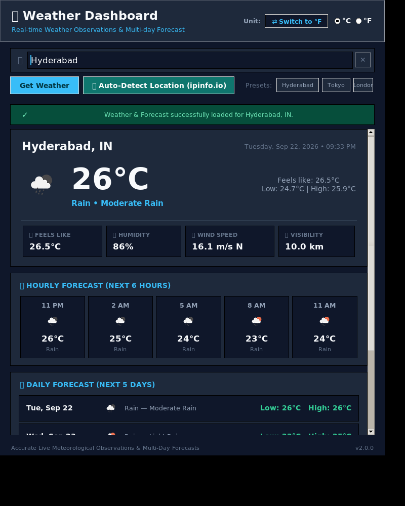

# 🌦 Real-Time Weather Application & Telemetry Station

[](https://www.python.org/)
[](https://docs.python.org/3/library/tkinter.html)
[](https://openweathermap.org/api)
[-brightgreen)](#automated-testing)
[](LICENSE)

> **OASIS Infobyte — Python Programming Internship**  
> **Project:** Task 4 — Weather App (Beginner & Advanced Tiers)  
> **Author:** Python Programming Intern  
> **Technology Stack:** Python 3 • Tkinter • Pillow (PIL) • Standard Library `urllib` • HTML5/CSS3 Web Station • OpenWeatherMap API

---

## 1. Project Overview

A robust, multi-interface meteorological platform that delivers real-time weather observations, a 6-to-12-hour upcoming timeline, a 5-day daily forecast, and scrollable human-readable telemetry diagnostics.

The project provides three seamless execution modes:
1. **Advanced Tier Desktop GUI (`weather_app.py` / `./run-weather-gui`):** Built with Python Tkinter and Pillow (PIL) with dark-slate card styling, procedural vector fallback icons, and dynamic unit toggling.
2. **Beginner Tier Terminal CLI (`weather_cli.py` / `./run-weather-cli`):** Zero-dependency terminal interface for quick observations with instant flag support.
3. **Interactive Web Station (`web_preview.py` / port 3000):** Real-time web station with auto-sync, metric/imperial switching, and scrollable diagnostic telemetry.

---

## 2. Key Features

### 🟢 Core Meteorological Observations
- **Dual-Mode Query Input:** Accepts city names (e.g., `Hyderabad`, `London, UK`, `Tokyo, JP`) or postal/ZIP codes (e.g., `94016`, `500081,IN`).
- **Input Validation:** Rejects empty or whitespace-only inputs before triggering network calls.
- **Comprehensive Measurements:**
  - Current temperature & "Feels Like" temperature in both Celsius (°C) and Fahrenheit (°F)
  - Atmospheric humidity percentage (%) and barometric pressure (hPa)
  - Wind speed (m/s and mph) and 16-point compass direction heading (e.g., `ENE`)
  - Astronomical sunrise and sunset local timings
  - Optical visibility distance (km and miles)
  - Weather condition category and verbose descriptive string

### 🌟 Advanced Forecast & Diagnostics
- **Next 6-to-12-Hour Timeline:** Immediate upcoming forecast intervals in 3-hour increments with precipitation probability (`pop`).
- **5-Day Daily Outlook:** Aggregates 40 forecast points into 5 calendar days with daily high/low temperatures and representative conditions.
- **Instant Unit Toggle:** Dynamically switch between **Metric (°C, m/s, km)** and **Imperial (°F, mph, mi)** with zero reloading.
- **Approximate IP Geolocation:** One-click location detection via `ipinfo.io` with complete fallback protection.
- **Scrollable Telemetry Diagnostics:** Human-readable diagnostic breakdown displaying coordinate grids, atmospheric indices, and system health status.
- **Zero-Crash Resilience:** Complete error trapping for HTTP 404 (city not found), HTTP 401 (invalid key), HTTP 429 (rate limits), and network timeouts.

---

## 3. Project Structure

```
.
├── weather_app.py          # Advanced Tier Tkinter Desktop GUI application
├── weather_cli.py          # Beginner Tier Terminal CLI application
├── web_preview.py          # Embedded HTTP server & Web Station controller
├── weather_service.py      # OpenWeatherMap Current Weather client & data parser
├── forecast_service.py     # 5-Day & 6-Hour forecast aggregation engine
├── location_service.py     # IP-based approximate geolocation helper
├── icon_manager.py         # Pillow icon cache & procedural vector fallback generator
├── config.py               # Central configuration, themes, compass mapping & validation
├── run-weather-cli         # Bash shortcut runner for the CLI tool
├── run-weather-gui         # Bash shortcut runner for the GUI application
├── requirements.txt        # Python dependency specifications
├── .env.example            # Environment template for OpenWeatherMap API key
├── .gitignore              # Git ignore rules for virtualenvs, keys, and bytecode
├── package.json            # Node/npm test, build, and dev automation scripts
├── index.html              # Frontend dashboard template for the Web Station
├── tests/
│   └── test_weather.py     # Automated unit test suite (11 unit tests)
├── assets/
│   └── icons/              # Cached weather icon assets
└── screenshots/            # Desktop GUI application captures
    ├── weather_dashboard_metric.png
    └── weather_dashboard_imperial.png
```

---

## 4. Installation & Setup

### Prerequisites
- **Python 3.10+** installed on Linux, macOS, or Windows.
- *(Optional for Desktop GUI)* Tkinter:
  - **Ubuntu / Debian:** `sudo apt-get install python3-tk python3-pil.imagetk`
  - **Fedora / RHEL:** `sudo dnf install python3-tkinter`
  - **macOS / Windows:** Included by default with the standard Python installer.

### Step 1: Clone the Repository
```bash
git clone https://github.com/your-username/oasis-weather-app-python.git
cd oasis-weather-app-python
```

### Step 2: Create and Activate Virtual Environment
```bash
# Linux / macOS
python3 -m venv venv
source venv/bin/activate

# Windows (Command Prompt)
python -m venv venv
venv\Scripts\activate

# Windows (PowerShell)
python -m venv venv
.\venv\Scripts\Activate.ps1
```

### Step 3: Install Dependencies
```bash
pip install -r requirements.txt
```

---

## 5. API Configuration

1. Obtain a free API key at [OpenWeatherMap](https://openweathermap.org/api).
2. Copy `.env.example` to `.env`:
   ```bash
   cp .env.example .env
   ```
3. Open `.env` and add your 32-character key:
   ```env
   OPENWEATHER_API_KEY=your_actual_32_character_api_key_here
   ```
> **Security Notice:** The `.gitignore` file excludes `.env` to prevent committing your API key to GitHub.

---

## 6. How to Run

### Option A: Desktop GUI (Advanced Tier)
```bash
python3 weather_app.py
# or using the shortcut runner:
./run-weather-gui
```

### Option B: Terminal CLI (Beginner Tier)
```bash
# Interactive Mode:
python3 weather_cli.py

# Direct Query Mode:
python3 weather_cli.py London, UK
python3 weather_cli.py 94016

# Using the shortcut runner:
./run-weather-cli Tokyo
```

### Option C: Web Dashboard & Telemetry Station
```bash
python3 web_preview.py
# Open your browser at: http://localhost:3000
```

---

## 7. Automated Testing

Run the comprehensive unit test suite covering input validation, conversions, parsing, and error trapping:

```bash
# Using Python's standard unittest runner:
python3 -m unittest discover tests

# Or using npm:
npm test
```

All 11 tests validate:
- Degree-to-compass conversion (0°, 90°, 180°, 270°, diagonals, error boundary)
- API key format verification
- Query parameter differentiation (City vs. Postal/ZIP)
- Empty input and whitespace rejection
- Full OpenWeatherMap payload parsing and unit conversions
- Hourly timeline and 5-day forecast aggregation
- Resilient location service error handling
- CLI input validation

---

## 8. GitHub Push Instructions

To push this repository to GitHub:

```bash
# 1. Initialize git repository (if not already initialized)
git init

# 2. Stage all files
git add .

# 3. Create initial commit
git commit -m "feat: complete weather application with GUI, CLI, Web station, and test suite"

# 4. Set main branch
git branch -M main

# 5. Add remote repository URL
git remote add origin https://github.com/<your-username>/<your-repo-name>.git

# 6. Push code to GitHub
git push -u origin main
```

---

## 9. Error Handling Matrix

| Scenario | Handled By | Behavior |
| :--- | :--- | :--- |
| **Empty Input** | `weather_cli.py` / `weather_app.py` | Validated before network call; displays user-friendly prompt. |
| **City Not Found** | `weather_service.py` | Catches HTTP 404, suggests checking spelling or format. |
| **Invalid API Key** | `weather_service.py` | Catches HTTP 401, advises checking `.env` configuration. |
| **Rate Limit** | `weather_service.py` | Catches HTTP 429, advises waiting briefly before retrying. |
| **Network Timeout** | `weather_service.py` | Traps socket/URL timeout, advises checking network connection. |
| **Missing Tkinter** | `weather_app.py` | Displays clear installation commands and offers CLI execution. |
| **Icon Failure** | `icon_manager.py` | Procedurally draws vector weather graphics using Pillow. |

---

## 10. Screenshots

### Metric View (°C) — Hyderabad, IN


### Imperial View (°F) — Unit Toggle Demo


---

## 11. License

This project is licensed under the MIT License — see the [LICENSE](LICENSE) file for details.
